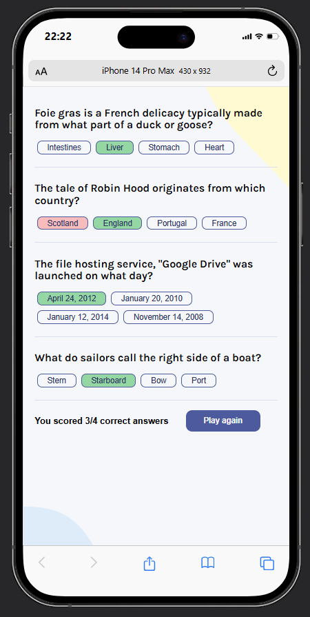

# Quizzical

A simple quiz application built with **React** that fetches multiple-choice questions from the Open Trivia Database API. Users can answer questions, check their score, and generate a new quiz.

## Preview

<!-- Add a screenshot or GIF here -->
<!--  -->

## Features

- Fetches random trivia questions from the Open Trivia Database
- Randomly shuffles answer choices
- Displays the user's score after submission
- Highlights:
  - Correct answers in green
  - Incorrect selections in red
- Play Again button to generate a new quiz
- Loading state while fetching questions
- Error state if the API request fails
- Decodes HTML entities for readable questions and answers
- Accessible form using semantic HTML (`fieldset`, `legend`)
- Screen reader support with `aria-live` and `aria-describedby`

## Built With

- React
- JavaScript (ES6+)
- CSS
- Open Trivia Database API
- html-entities
- clsx
- react-icons

## Preview

## Accessibility

This project includes several accessibility improvements:

- Semantic grouping with `fieldset` and `legend`
- Keyboard-friendly radio buttons
- Screen reader feedback using `aria-describedby`
- Live score announcement using `aria-live`
- Loading and error states

## API

Questions are fetched from the Open Trivia Database:

https://opentdb.com/

## Future Improvements

- Select quiz category
- Select difficulty
- Choose the number of questions
- Timer mode
- Dark mode
- Save high scores
- Responsive animations
- Better loading skeleton

## What I Learned

While building this project, I practiced:

- React Hooks (`useState`, `useEffect`)
- Fetching asynchronous data
- Managing loading and error states
- State management
- Conditional rendering
- Working with forms
- Accessibility best practices
- Shuffling arrays using the Fisher–Yates algorithm
- Organizing React components
